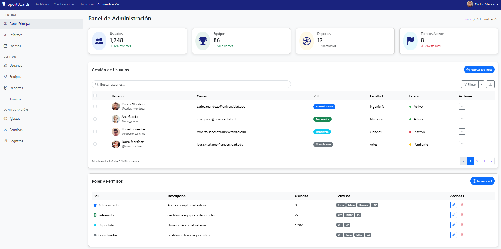
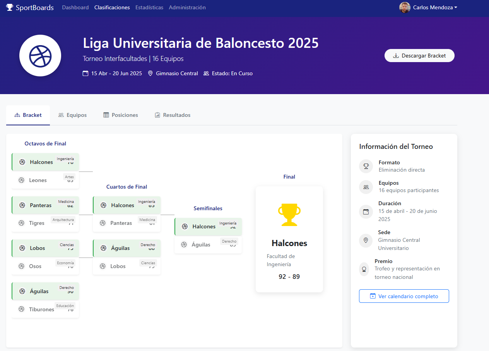
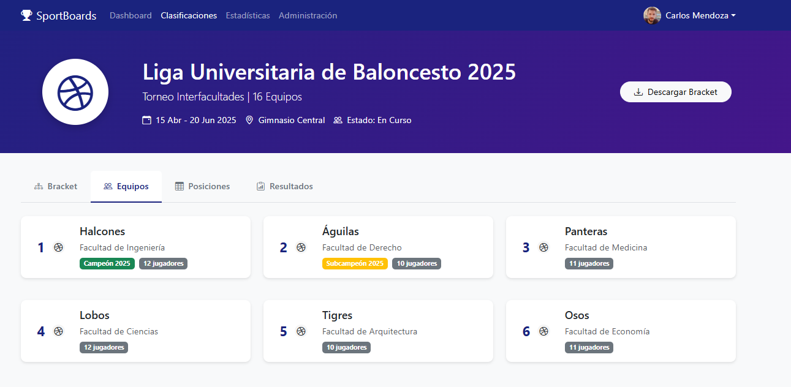
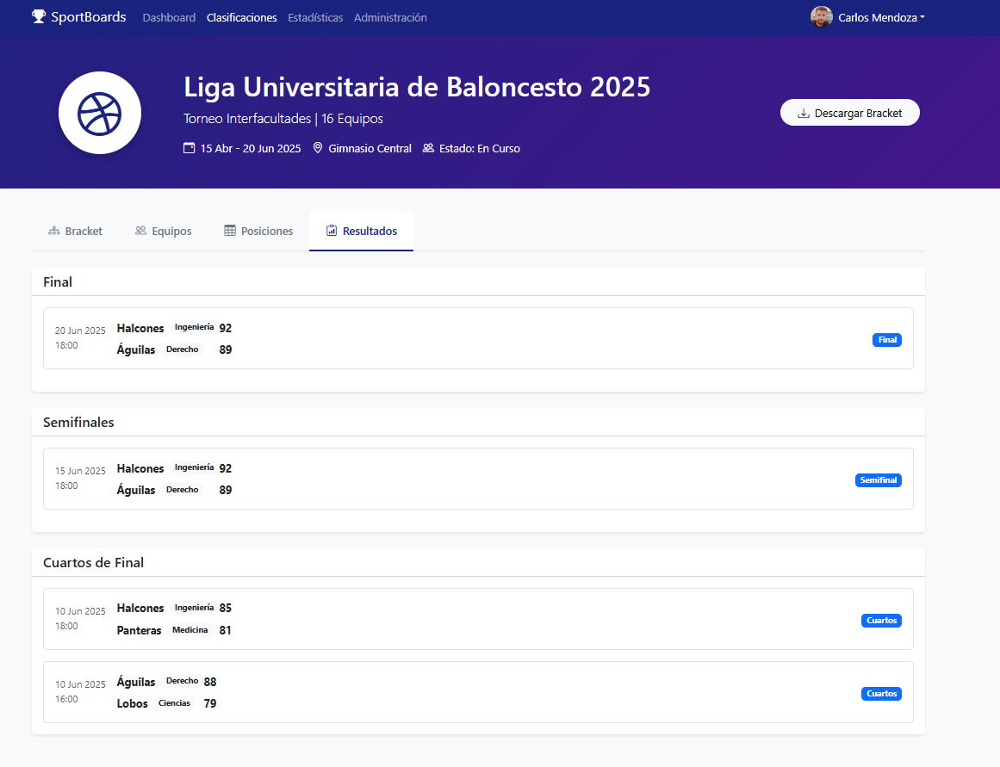
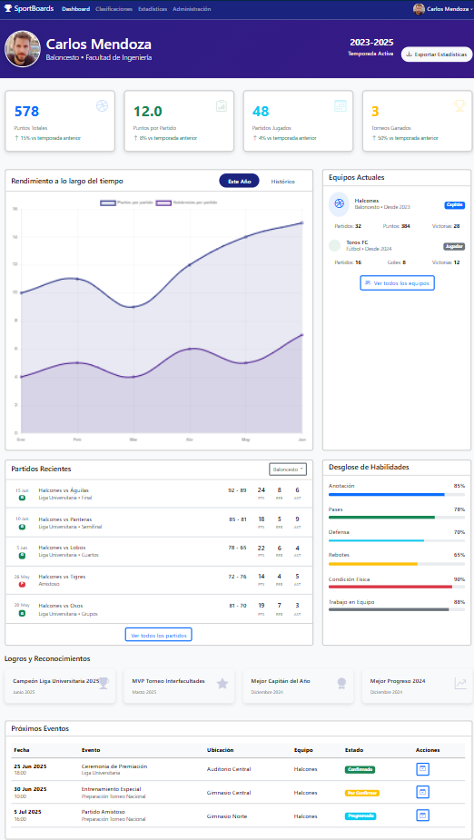
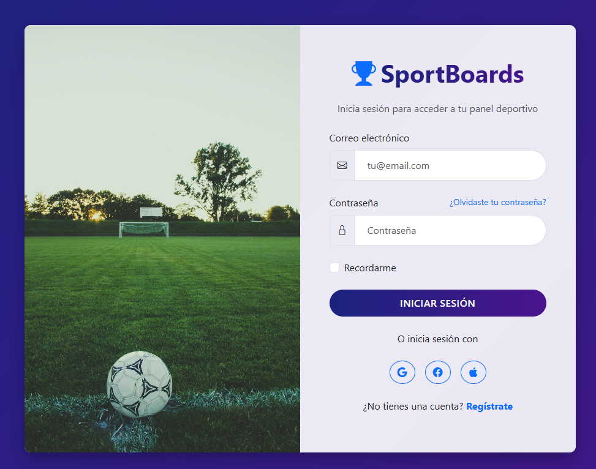
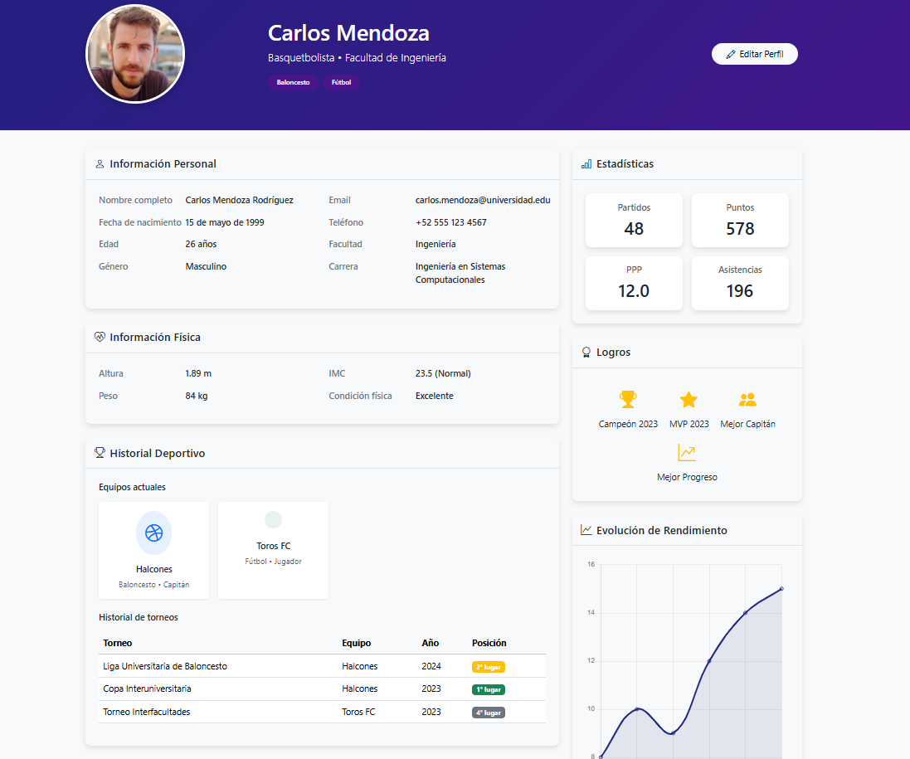

# SportBoards - Plataforma de Gestión Deportiva

SportBoards es una plataforma moderna para la gestión y visualización de estadísticas deportivas, clasificaciones de torneos, perfiles de deportistas y administración de usuarios. Esta aplicación ofrece una interfaz intuitiva y atractiva desarrollada con tecnologías web modernas.

## Capturas de Pantalla

### Panel de Administración


### Clasificaciones de Torneos





### Dashboard del Deportista


### Página de Login


### Perfil de Usuario


## Tecnologías Utilizadas

- **Frontend**: HTML5, CSS3, JavaScript
- **Framework CSS**: Bootstrap 5.3.3
- **Iconos**: Bootstrap Icons 1.11.1
- **Gráficos**: Chart.js
- **Diseño Responsivo**: Compatible con dispositivos móviles, tablets y escritorio

## Características Implementadas

1. **Panel de Administración**: Gestión de usuarios, permisos y roles con una interfaz clara y funcional.

2. **Sistema de Clasificaciones**: Visualización intuitiva de torneos con brackets de eliminación, mostrando equipos y sus facultades correspondientes.

3. **Dashboard de Deportista**: Estadísticas personales, rendimiento a lo largo del tiempo, equipos anteriores, puntos marcados y métricas relevantes.

4. **Sistema de Login**: Interfaz de acceso moderna y segura, con diseño temático deportivo acorde a la marca SportBoards.

5. **Perfil de Usuario**: Visualización de datos personales (imagen, información biométrica, historial) con un diseño moderno y bien estructurado.

6. **Estadísticas Deportivas**: Página dedicada a mostrar estadísticas generales, comparativas entre equipos y deportistas, y récords históricos.

## Proceso de Desarrollo

El desarrollo de SportBoards se realizó siguiendo las mejores prácticas de UI/UX para aplicaciones web deportivas. El proceso incluyó:

1. **Investigación**: Análisis de plataformas similares para identificar patrones de diseño efectivos.

2. **Diseño**: Creación de maquetas y prototipos enfocados en la experiencia de usuario.

3. **Implementación**: Desarrollo de interfaces responsivas utilizando Bootstrap para garantizar compatibilidad con diferentes dispositivos.

4. **Optimización**: Mejora de la interfaz para asegurar tiempos de carga rápidos y navegación intuitiva.

## Prompt Original

> Necesito que hagas un template o un preview, con un buen UI UX, siguiendo buenos patrones, requiero:
> 
> 1. Un panel de administración de usuarios, permisos, etc.
> 2. Una página de clasificación tal que así como se ven esos cuadros donde se van eliminando los equipos en la final uno por uno:
>    ```
>    -----eq1
>    -      --------eq1
>    -----eq2
>    ```
>    Que se muestren los equipos, la facultad a la que pertenecen, etc.
> 3. Requiero una página de dashboard de un deportista donde pueda ver su rendimiento a lo largo del tiempo, los equipos que ha formado, donde ha jugado, puntos marcados, etc.
> 4. Necesito un login muy bueno, sabiendo que es de deportes y la aplicación se llama SportBoards.
> 5. Necesito un perfil de usuario en general, que contenga una imagen, datos personales, peso, altura, edad, nacimiento, etc., bien organizado y estructurado, sin que se vea como un formulario.
> 6. También necesito una página con las estadísticas y sus cosas esenciales.
> 
> Solo son previews/templates, implementa Bootstrap para un desarrollo más rápido.