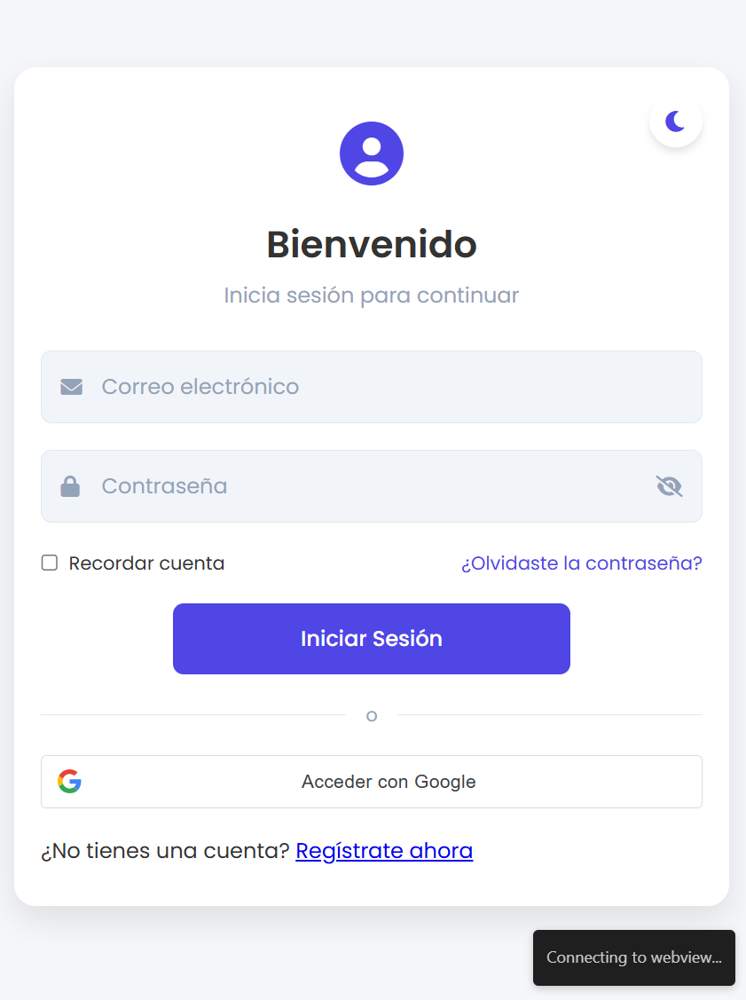
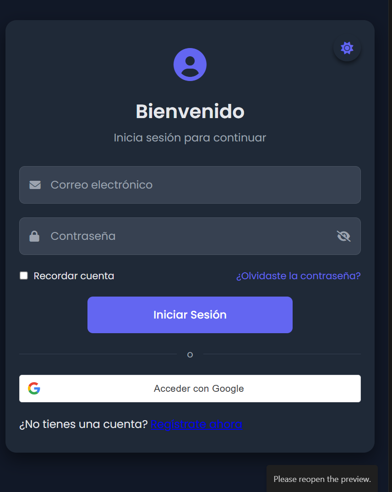

# Template de Login Moderno

Este proyecto consiste en un template de login moderno con características de UI/UX avanzadas, incluyendo modo claro/oscuro, opciones de login con correo y Google, y una interfaz responsiva.

## Modo Claro

## Modo Oscuro

## Descripción del Proyecto

Un template de interfaz de usuario para un sistema de login, diseñado con las mejores prácticas de UI/UX, que incluye:
- Interfaz moderna y atractiva
- Soporte para modo claro y oscuro
- Opciones de autenticación múltiples
- Diseño completamente responsivo

## Pasos Realizados

### 1. Creación de la Estructura Base

1. **Configuración del HTML inicial**
   - Creación de la estructura básica HTML5
   - Configuración de meta tags para responsividad
   - Inclusión de fuentes (Poppins) y librerías Font Awesome
   - Estructuración del contenedor principal y áreas de login

2. **Organización del Formulario**
   - Implementación de campos de entrada para correo y contraseña
   - Adición de opción "Recordar cuenta"
   - Creación de enlaces para recuperación de contraseña y registro
   - Implementación de divider para separar métodos de autenticación

3. **Diseño Visual Inicial**
   - Estructura de dos columnas (imagen + formulario)
   - Implementación de icono de usuario
   - Diseño del formulario con inputs estilizados
   - Botón de login y opción de registro

### 2. Implementación de Estilos CSS

1. **Sistema de Colores Variables**
   - Definición de variables CSS para modo claro
   - Definición de variables CSS para modo oscuro
   - Implementación de transiciones suaves entre modos

2. **Estilización de Componentes**
   - Diseño de inputs con iconos
   - Estilización de botones con efectos hover
   - Implementación de checkbox personalizado
   - Diseño de divider con línea y texto

3. **Responsividad**
   - Media queries para dispositivos móviles
   - Ajuste de layout para pantallas pequeñas
   - Ocultación de imagen en dispositivos móviles
   - Ajuste de tamaños y espaciados

### 3. Funcionalidad JavaScript

1. **Implementación del Toggle de Tema**
   - Función para alternar entre modo claro y oscuro
   - Almacenamiento de preferencia en localStorage
   - Actualización de icono según el modo seleccionado

2. **Funcionalidad de Contraseña**
   - Toggle para mostrar/ocultar contraseña
   - Cambio de icono al alternar visibilidad
   - Mantenimiento de estado del campo

3. **Manejo de Eventos**
   - Prevención de envío de formulario para demostración
   - Captura de eventos de botones
   - Logging de acciones en consola

### 4. Mejora del Botón de Google

1. **Integración de API Oficial**
   - Inclusión de la librería Google Sign-In
   - Configuración del botón oficial de Google
   - Implementación de botón personalizado de respaldo

2. **Estilización Mejorada**
   - Diseño del botón siguiendo directrices de Google
   - Soporte completo para modo oscuro
   - Efectos visuales mejorados (hover, active)
   - Inclusión de la fuente Roboto para autenticidad

3. **Funcionalidad Avanzada**
   - Implementación de manejador de respuestas de autenticación
   - Soporte para tokens JWT
   - Función para decodificar información del usuario
   - Adaptación automática al tema del sistema

### 5. Mejoras de UI/UX

1. **Centrado del Botón de Login**
   - Modificación del CSS para centrar horizontalmente
   - Ajuste de ancho para mejor estética
   - Mantenimiento de estilos originales y efectos

2. **Refinamiento Visual**
   - Consistencia en colores y espaciados
   - Mejora de contrastes para accesibilidad
   - Efecto de sombras para profundidad
   - Transiciones suaves para interacciones

## Tecnologías Utilizadas

- **HTML5**: Estructura semántica del documento
- **CSS3**: Estilización avanzada con variables y media queries
- **JavaScript**: Funcionalidad del lado del cliente
- **Google Sign-In API**: Integración de autenticación con Google
- **Font Awesome**: Iconografía
- **Google Fonts**: Tipografías Poppins y Roboto

## Características Destacadas

- **Modo Oscuro/Claro**: Cambio de tema con persistencia en localStorage
- **Diseño Responsivo**: Adaptación a diferentes tamaños de pantalla
- **Autenticación Múltiple**: Soporte para correo y Google
- **Visibilidad de Contraseña**: Opción para mostrar/ocultar
- **Experiencia Visual Refinada**: Efectos hover, transiciones y feedback visual

## Notas de Implementación

Este template es puramente visual y no incluye la lógica real de autenticación. Para implementar la funcionalidad completa se requeriría:

1. Configurar un backend para autenticación
2. Obtener un ID de cliente de Google desde la Google Developer Console
3. Implementar validación de formularios
4. Configurar manejo de sesiones
5. Implementar redirecciones post-login

## Cómo Usar

1. Clona este repositorio
2. Abre `index.html` en tu navegador
3. Para implementar la autenticación con Google, reemplaza `YOUR_GOOGLE_CLIENT_ID` con tu ID de cliente real
4. Personaliza colores y estilos en `index.css` según tu marca
5. Conecta con tu backend modificando `index.js`
