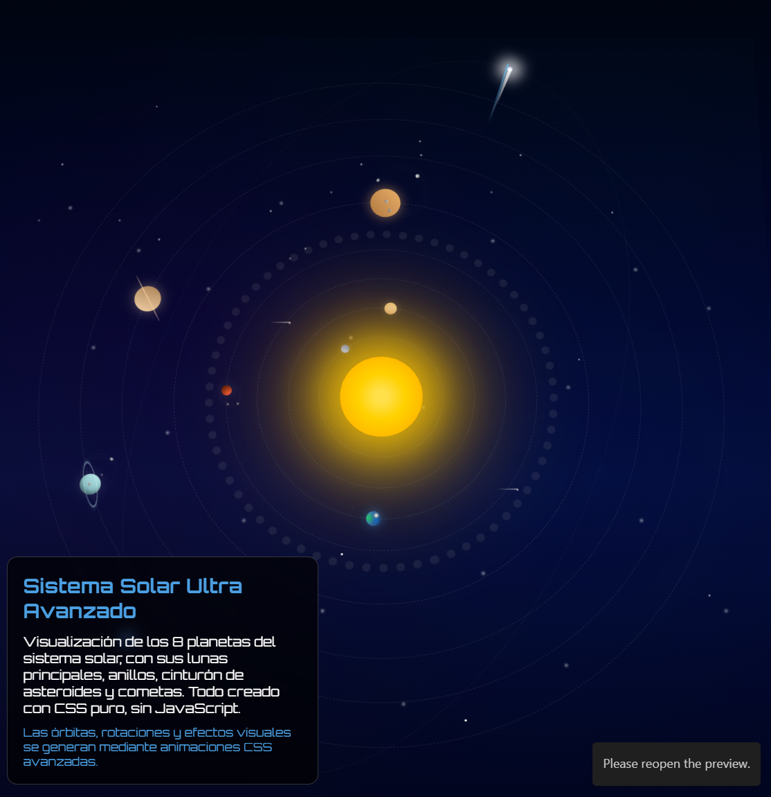

# Maqueta del Sistema Solar

## Descripción del Proyecto
Este proyecto es una visualización interactiva del Sistema Solar creada completamente con HTML y CSS puro, sin utilizar JavaScript. La maqueta representa los 8 planetas del sistema solar con sus características distintivas, incluyendo:

- Órbitas planetarias con diferentes velocidades y tamaños
- Lunas principales alrededor de los planetas
- Anillos de Saturno y Urano
- Cinturón de asteroides
- Cometas orbitando el Sol
- Efectos visuales como nebulosas, estrellas fijas, estrellas parpadeantes y estrellas fugaces

## Características Técnicas
- **Animaciones CSS avanzadas**: Todas las órbitas, rotaciones y efectos visuales se generan mediante animaciones CSS.
- **Diseño responsivo**: La visualización se adapta a diferentes tamaños de pantalla.
- **Efectos visuales detallados**: Incluye nebulosas cósmicas, estrellas que parpadean y otros efectos para crear una experiencia inmersiva.
- **Composición 3D**: Utiliza perspectiva y transformaciones 3D para crear profundidad visual.

## Componentes del Sistema Solar Representados
- Sol (centro del sistema)
- Mercurio
- Venus
- Tierra (con su luna)
- Marte (con sus dos lunas)
- Cinturón de asteroides
- Júpiter (con cuatro lunas principales)
- Saturno (con su sistema de anillos)
- Urano (con anillos y dos lunas)
- Neptuno (con una luna)
- Cometa en órbita

## Tecnologías Utilizadas
- HTML5
- CSS3 (animaciones, transformaciones 3D, variables CSS)
- Fuentes web (Google Fonts: Orbitron y Space Mono)

## Propósito Educativo
Esta maqueta sirve como herramienta educativa para visualizar la estructura básica del sistema solar y las relaciones espaciales entre sus componentes. Además, demuestra el potencial de CSS moderno para crear visualizaciones complejas sin necesidad de JavaScript.

## Imagen del Proyecto
La imagen al inicio de este README muestra una captura de pantalla del proyecto en funcionamiento. Para actualizar esta imagen:

1. Abre el archivo `index.html` en un navegador web moderno
2. Usa la herramienta de captura de pantalla de tu sistema operativo o navegador para capturar la visualización
3. Guarda la imagen como `screenshot.png` en la carpeta raíz del proyecto
4. Alternativamente, puedes abrir el archivo `screenshot-preview.html` que muestra una versión estática del sistema solar para capturar la imagen

También puedes abrir el archivo `screenshot-preview.html` incluido en este proyecto para ver una representación visual estática del sistema solar que puedes usar como imagen de referencia.